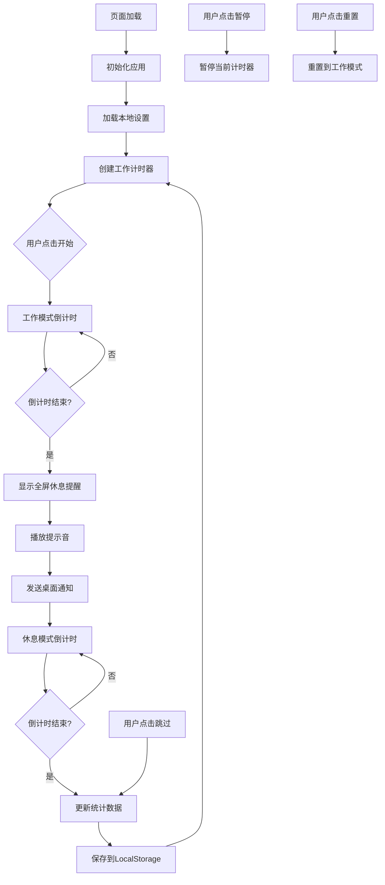

# 20-20-20 护眼法则提醒工具 - 技术规划文档

## 📋 项目概述

创建一个基于 Web 的护眼提醒工具，实现 20-20-20 法则：
- 每工作 **20 分钟**
- 提醒用户看向 **20 英尺**（约 6 米）外的物体
- 持续 **20 秒**

## 🎯 核心功能需求

### 1. 计时器功能
- **工作模式**：20 分钟倒计时
- **休息模式**：20 秒倒计时
- 实时显示剩余时间（分:秒格式）
- 环形进度条可视化

### 2. 控制功能
- 开始/暂停按钮
- 重置按钮
- 跳过当前阶段按钮（仅在休息时可用）

### 3. 提醒系统
- 全屏休息提醒界面
- 浏览器桌面通知
- 音频提示音（可选）
- 视觉动画效果

### 4. 统计功能
- 记录今日完成循环次数
- 累计完成循环次数
- 累计护眼时长
- 数据本地持久化

### 5. 设置功能
- 自定义工作时长（默认 20 分钟）
- 自定义休息时长（默认 20 秒）
- 主题切换（浅色/深色模式）
- 声音开关
- 通知权限管理

## 🏗️ 技术架构

### 技术栈
```
前端：纯原生技术栈
├── HTML5        # 语义化结构
├── CSS3         # 现代样式、动画、响应式
└── JavaScript   # ES6+ 原生 JS，无需框架
```

### 数据存储
```
LocalStorage
├── settings      # 用户设置
├── statistics    # 统计数据
└── theme         # 主题偏好
```

### 浏览器 API
```
使用的 Web APIs：
├── Notification API      # 桌面通知
├── Web Audio API        # 音频播放
├── LocalStorage API     # 数据持久化
└── Page Visibility API  # 页面可见性检测
```

## 📁 项目结构

```
eye-care-20-20-20/
├── index.html              # 主页面
├── css/
│   └── style.css          # 样式文件
├── js/
│   ├── timer.js           # 计时器核心类
│   ├── ui.js              # UI 更新逻辑
│   ├── notification.js    # 通知系统
│   ├── storage.js         # 数据存储管理
│   └── app.js             # 主应用入口
├── assets/
│   ├── sounds/
│   │   └── notification.mp3  # 提示音
│   └── icons/
│       └── favicon.ico    # 网站图标
├── PLAN.md                # 本规划文档
└── README.md              # 用户文档
```

## 🎨 UI/UX 设计

### 主界面布局
```
┌─────────────────────────────────┐
│          20-20-20 护眼助手        │
├─────────────────────────────────┤
│                                 │
│         ╭──────────╮            │
│         │          │            │
│         │  19:45   │  ← 大号时钟 │
│         │          │            │
│         ╰──────────╯            │
│                                 │
│       [工作中 💼]  ← 状态指示    │
│                                 │
│    ⏸️ 暂停   🔄 重置  ← 控制按钮 │
│                                 │
├─────────────────────────────────┤
│  📊 今日: 8次 | 总计: 156次     │
├─────────────────────────────────┤
│  ⚙️ 设置  📈 统计  🌓 主题      │
└─────────────────────────────────┘
```

### 休息提醒界面
```
┌─────────────────────────────────┐
│                                 │
│                                 │
│         🌟 休息时间到了！        │
│                                 │
│    请看向 6 米外的物体 20 秒     │
│                                 │
│             ⏱️ 18               │
│                                 │
│         [跳过休息 →]             │
│                                 │
└─────────────────────────────────┘
```

### 色彩方案

**浅色主题：**
- 主色：`#4CAF50` (绿色，代表健康)
- 背景：`#FFFFFF`
- 文字：`#333333`
- 次要色：`#F5F5F5`

**深色主题：**
- 主色：`#66BB6A`
- 背景：`#1E1E1E`
- 文字：`#E0E0E0`
- 次要色：`#2D2D2D`

## 💻 核心代码结构

### 1. Timer 类（timer.js）
```javascript
class Timer {
  constructor(duration, onTick, onComplete) {
    this.duration = duration;
    this.remaining = duration;
    this.onTick = onTick;
    this.onComplete = onComplete;
    this.intervalId = null;
    this.isPaused = false;
  }

  start() { /* 启动计时 */ }
  pause() { /* 暂停计时 */ }
  reset() { /* 重置计时 */ }
  getRemainingTime() { /* 获取剩余时间 */ }
}
```

### 2. 应用状态管理
```javascript
const AppState = {
  WORK: 'work',      // 工作模式
  BREAK: 'break',    // 休息模式
  PAUSED: 'paused'   // 暂停状态
};

let currentState = AppState.WORK;
let currentTimer = null;
```

### 3. 数据存储结构
```javascript
// LocalStorage 数据结构
{
  settings: {
    workDuration: 1200,    // 20分钟（秒）
    breakDuration: 20,     // 20秒
    soundEnabled: true,
    notificationEnabled: true,
    theme: 'light'
  },
  statistics: {
    todayCount: 0,
    totalCount: 0,
    lastResetDate: '2025-10-10',
    totalBreakTime: 0      // 累计休息时长（秒）
  }
}
```

## 🔄 核心流程图



## ✨ 功能实现细节

### 1. 环形进度条实现
使用 SVG + CSS 实现：
```html
<svg class="progress-ring">
  <circle class="progress-ring-bg"></circle>
  <circle class="progress-ring-circle"></circle>
</svg>
```

动态更新 `stroke-dashoffset` 属性实现进度动画。

### 2. 全屏提醒
使用 CSS 固定定位 + 模糊背景：
```css
.break-overlay {
  position: fixed;
  top: 0;
  left: 0;
  width: 100vw;
  height: 100vh;
  background: rgba(0, 0, 0, 0.9);
  backdrop-filter: blur(10px);
  z-index: 9999;
}
```

### 3. 桌面通知
请求权限并发送通知：
```javascript
async function requestNotificationPermission() {
  if ('Notification' in window) {
    const permission = await Notification.requestPermission();
    return permission === 'granted';
  }
  return false;
}

function sendNotification(title, body) {
  new Notification(title, {
    body: body,
    icon: '/assets/icons/favicon.ico',
    badge: '/assets/icons/badge.png'
  });
}
```

### 4. 音频提示
使用 Web Audio API：
```javascript
const audio = new Audio('assets/sounds/notification.mp3');
audio.play();
```

### 5. 主题切换
通过切换 body 的 class 实现：
```javascript
function toggleTheme() {
  const isDark = document.body.classList.toggle('dark-theme');
  localStorage.setItem('theme', isDark ? 'dark' : 'light');
}
```

## 📱 响应式设计

### 断点设置
```css
/* 移动设备 */
@media (max-width: 768px) {
  /* 调整字体大小、按钮间距 */
}

/* 平板设备 */
@media (min-width: 769px) and (max-width: 1024px) {
  /* 中等屏幕优化 */
}

/* 桌面设备 */
@media (min-width: 1025px) {
  /* 大屏幕布局 */
}
```

## 🔒 安全性考虑

1. **XSS 防护**：所有用户输入进行转义
2. **数据验证**：验证 LocalStorage 数据完整性
3. **错误处理**：优雅处理 API 不可用情况

## 🚀 性能优化

1. **防抖处理**：窗口大小调整事件使用防抖
2. **内存管理**：及时清理定时器
3. **懒加载**：音频文件按需加载
4. **缓存策略**：CSS/JS 文件添加版本号

## 🧪 测试计划

### 功能测试
- ✅ 计时器准确性
- ✅ 暂停/恢复功能
- ✅ 数据持久化
- ✅ 通知触发
- ✅ 跨浏览器兼容性

### 兼容性测试
- Chrome 90+
- Firefox 88+
- Safari 14+
- Edge 90+

## 📦 部署方案

### 静态托管
可部署到：
- GitHub Pages
- Netlify
- Vercel
- 本地文件直接打开

### PWA 支持（可选扩展）
添加 `manifest.json` 和 Service Worker 实现离线使用。

## 🎓 使用说明

### 基本使用
1. 打开 `index.html`
2. 点击"开始"按钮
3. 工作 20 分钟后会自动提醒休息
4. 休息 20 秒后自动返回工作模式

### 自定义设置
1. 点击设置图标
2. 调整工作/休息时长
3. 开启/关闭声音和通知
4. 选择喜欢的主题

## 📈 未来扩展

- [ ] 每日护眼报告
- [ ] 工作专注度分析
- [ ] 多设备数据同步（需后端）
- [ ] 眼保健操视频引导
- [ ] 番茄工作法模式
- [ ] 快捷键支持
- [ ] 多语言支持

## 📝 开发清单

- [ ] 搭建基础 HTML 结构
- [ ] 实现响应式 CSS 布局
- [ ] 开发计时器核心功能
- [ ] 添加进度条动画
- [ ] 实现全屏休息提醒
- [ ] 集成通知系统
- [ ] 开发统计功能
- [ ] 实现设置面板
- [ ] 添加主题切换
- [ ] 完善错误处理
- [ ] 编写用户文档
- [ ] 浏览器测试

---

**预计开发时间**：2-3 小时
**难度等级**：⭐⭐⭐ (中等)
**适合人群**：所有需要长时间使用电脑的用户